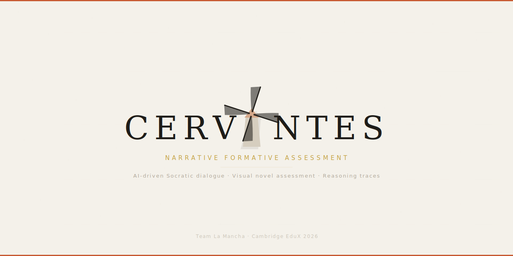

<p align="center">
  
</p>

<h3 align="center">Cervantes</h3>
<p align="center">Narrative formative assessment framework</p>
<p align="center">
  <a href="https://cambridge-edtech-society.org/edux/edux-2026.html">Cambridge EduX Hackathon 2026</a> · Challenge 1: Redefining Higher Education Assessment
</p>

---

## What is this?

Cervantes is an AI-supported assessment system that replaces static Q&A with visual-novel-style Socratic dialogue. Teachers configure assessment arcs around their syllabus; students encounter narrative scenes where AI characters probe their reasoning, push back on weak logic, and prompt revision. The system captures the full reasoning trace — not just final answers.

## How it works

**Teachers** upload rubric focus and concept targets → CurricuLLM extracts curriculum-aligned structure → an LLM generates a narrative arc with Socratic checkpoints → the teacher reviews and publishes.

**Students** enter a VN-style scene → a character presents a scenario tied to a real concept → the student responds → the AI pushes back → the student revises → the reasoning trace (initial answer, misconception, revision, reflection) is stored.

**Educators** see a dashboard of reasoning evidence, misconception patterns, and concept readiness — not just scores.

## Architecture

```
┌─────────────────────┐     ┌──────────────┐
│  React PWA          │────▶│  FastAPI      │
│  (Student VN view)  │◀────│  Backend      │
│  (Educator dash)    │     └──────┬───────┘
└─────────────────────┘            │
                          ┌────────┼────────┐
                          ▼        ▼        ▼
                    CurricuLLM  Gemini   SQLite
                    (curriculum (dialogue (reasoning
                     grounding)  engine)   traces)
```

## Stack

- **Frontend**: React (PWA)
- **Backend**: Python / FastAPI
- **Curriculum intelligence**: [CurricuLLM API](https://curricullm.com/developers)
- **Dialogue generation**: Gemini
- **Database**: SQLite (hackathon) → PostgreSQL (production)
- **Deployment**: Docker Compose (local) → GCP

## Backend

The backend is containerised using Docker and runs alongside a PostgreSQL database.

### Running the backend

1. Install and run Docker Desktop

2. From the project root directory, start the services:

```bash
docker compose up --build
```

3. Verify the backend is working:

Open in a browser:

```
http://localhost:8000/api/health
```

Expected response:

```json
{"status":"ok"}
```
