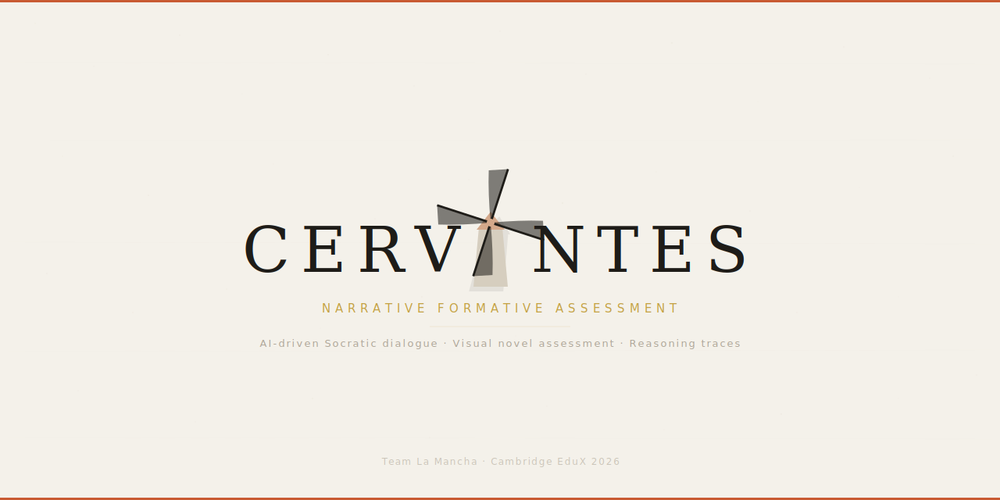
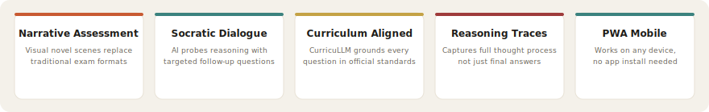
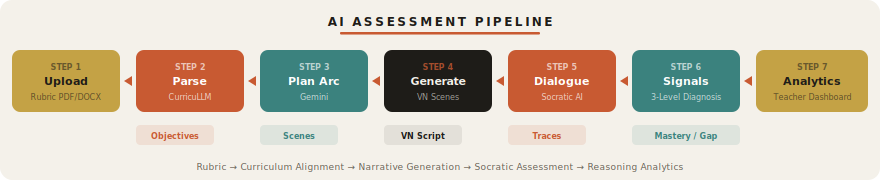

<p align="center">
  
</p>

<h1 align="center">Cervantes</h1>
<p align="center"><strong>AI-Powered Narrative Formative Assessment</strong></p>

<p align="center">
  <a href="https://cervantes-teacher--cervantes-caebc.asia-southeast1.hosted.app"></a>
  &nbsp;
  <a href="https://cervantes-caebc.web.app"></a>
  &nbsp;
  <a href="https://synaeri.github.io/Cervantes/"></a>
</p>
<p align="center">
  <a href="https://cervantes-api-878325801565.asia-southeast1.run.app/health"></a>
  &nbsp;
  <a href="https://cambridge-edtech-society.org/edux/edux-2026.html"></a>
</p>

<p align="center">
  
  
  
  
  
  
  
  
  
  
</p>

---

## The Problem

Traditional assessments measure recall under pressure, not genuine understanding. Educators see scores but never thought processes. There is no middle ground between hand-graded essays and automated quizzes.

## Our Solution

Cervantes transforms assessment into **Visual Novel experiences** &mdash; curriculum-aligned, AI-generated scenarios where students demonstrate understanding through dialogue and decision-making.

<p align="center">
  
</p>

<table>
<tr>
<td width="33%" valign="top">

### For Teachers
Upload a rubric &rarr; AI generates a narrative assessment arc &rarr; review and publish &rarr; monitor student reasoning in real-time with per-dimension analytics.

</td>
<td width="33%" valign="top">

### For Students
Enter an arc &rarr; engage with AI characters in VN-style scenes &rarr; respond to Socratic questioning &rarr; receive scaffolded pushback &rarr; reasoning is captured, not just answers.

</td>
<td width="34%" valign="top">

### For Educators
Dashboard of reasoning evidence, misconception patterns, and concept mastery &mdash; colour-coded at three levels: **mastery**, **revised with scaffolding**, **critical gap**.

</td>
</tr>
</table>

---

## Architecture

<p align="center">
  
</p>

---

## AI Assessment Pipeline

<p align="center">
  
</p>

| Phase | Engine | Input | Output |
|-------|--------|-------|--------|
| **1. Parse Rubric** | CurricuLLM-AU | PDF / DOCX / TXT | Learning objectives, misconceptions |
| **2. Plan Arc** | Gemini 2.5 Flash | Curriculum data | 3-5 scenes with concept targets |
| **3. Generate Scenes** | Gemini 2.5 Flash | Arc plan + characters | Full VN scripts with emotion tags |
| **4. Socratic Dialogue** | Gemini 2.5 Flash | Student response + history | Pushback questions (&le;5 turns) |
| **5. Signal Extraction** | Gemini 2.5 Flash | Conversation trace | mastery / revised / critical_gap |
| **6. Arc Ending** | Gemini 2.5 Flash | Aggregated performance | Personalised narrative ending |

---

## Quick Start

### Prerequisites

- Docker & Docker Compose
- Node.js 20+
- API keys: `GEMINI_API_KEY`, `CURRICULLM_API_KEY`
- Firebase service account credentials

### Run Locally

```bash
# 1. Backend (FastAPI + PostgreSQL)
docker compose up --build
# Verify: curl http://localhost:8000/health

# 2. Student Dashboard (PWA)
cd student-dashboard && npm install && npm run dev    # :3000

# 3. Teacher Dashboard
cd teacher-dashboard && npm install && npm run dev    # :3001
```

### Environment Variables

| Variable | Required | Description |
|----------|----------|-------------|
| `GEMINI_API_KEY` | Yes | Google Gemini 2.5 Flash |
| `CURRICULLM_API_KEY` | Yes | CurricuLLM curriculum engine |
| `DATABASE_URL` | Yes | PostgreSQL connection string |
| `JWT_SECRET` | Yes | JWT signing secret |
| `GOOGLE_APPLICATION_CREDENTIALS` | Yes | Firebase service account JSON path |
| `NEXT_PUBLIC_API_URL` | No | Backend URL (default `http://localhost:8080`) |

---

## Project Structure

```
Cervantes/
├── app/
│   ├── backend/          # FastAPI — 13 feature modules
│   │   ├── core/         # Auth, config, LLM clients, Firebase
│   │   ├── features/     # arc, dialogue, scenes, students, ...
│   │   └── sql/          # PostgreSQL init scripts
│   └── prompts/          # LLM prompt templates
│       ├── system/       # Socratic dialogue, scene gen, signals
│       ├── curricullm/   # Rubric parsing prompts
│       └── annotations/  # VN formatting (emotions, actions)
├── student-dashboard/    # Next.js 16 PWA — Visual Novel player
├── teacher-dashboard/    # Next.js 16 — Analytics dashboard
├── assets/               # SVG diagrams, banner
├── dev/tut/              # Tutorial site (GitHub Pages)
├── docker-compose.yml
├── Makefile              # Test runner commands
└── firestore.indexes.json
```

---

## Testing

```bash
make test-unit             # Backend unit tests
make test-integration      # Integration tests (mocked Firebase)
make test-dynamic          # LLM output schema validation
make test-eval             # Pedagogical quality metrics
make test-e2e-student      # Playwright E2E — student dashboard
make test-e2e-teacher      # Playwright E2E — teacher dashboard
make test-all              # Everything
make test-coverage         # HTML coverage report
```

---

## Deployment

| Component | Platform | Region |
|-----------|----------|--------|
| Backend | GCP Cloud Run | australia-southeast1 |
| Student PWA | Firebase App Hosting | auto |
| Teacher Dashboard | Firebase App Hosting | auto |

```bash
./scripts/deploy.sh --env-file app/backend/.env
```

---

## Responsible AI

<table>
<tr>
<td width="50%">

**Safeguards**
- Teachers review and approve all AI-generated content before publication
- Socratic pushback evaluates reasoning quality, not language fluency
- Students know they interact with AI &mdash; full transparency
- Character randomisation prevents stereotyping and copying
- Reasoning traces are protected educational records

</td>
<td width="50%">

**Compliance Alignment**
- FERPA-ready architecture
- GDPR data minimisation principles
- Australian Privacy Act (APP) guidelines
- UNESCO Recommendation on Ethics of AI in Education
- Google Responsible AI Principles

</td>
</tr>
</table>

---

## Documentation

Full interactive tutorial site: **[synaeri.github.io/Cervantes](https://synaeri.github.io/Cervantes/)**

| Guide | Description |
|-------|-------------|
| [Architecture](https://synaeri.github.io/Cervantes/architecture.html) | System design, tech stack, Firestore schema |
| [Teacher Guide](https://synaeri.github.io/Cervantes/teacher-guide.html) | Professor journey: rubric &rarr; publish &rarr; monitor |
| [Student Guide](https://synaeri.github.io/Cervantes/student-guide.html) | Student journey: scenes &rarr; dialogue &rarr; journal |
| [AI Pipeline](https://synaeri.github.io/Cervantes/ai-pipeline.html) | 7-phase AI assessment pipeline deep dive |
| [API Reference](https://synaeri.github.io/Cervantes/api-reference.html) | 47 REST endpoints across 13 modules |
| [Demo Playbook](https://synaeri.github.io/Cervantes/demo-playbook.html) | Hackathon presentation script & checklist |
| [Setup Guide](https://synaeri.github.io/Cervantes/setup.html) | Local dev environment & troubleshooting |

---

## Team

<table>
<tr>
<td align="center"><strong>Jordan</strong><br/>Frontend & Narrative Arc</td>
<td align="center"><strong>Liu</strong><br/>Backend & Cloud</td>
<td align="center"><strong>Adrian</strong><br/>Assets & Infrastructure</td>
</tr>
</table>

<p align="center">
  <sub>Cambridge EduX Hackathon 2026 &mdash; Challenge 1: Redefining Higher Education Assessment</sub>
</p>
